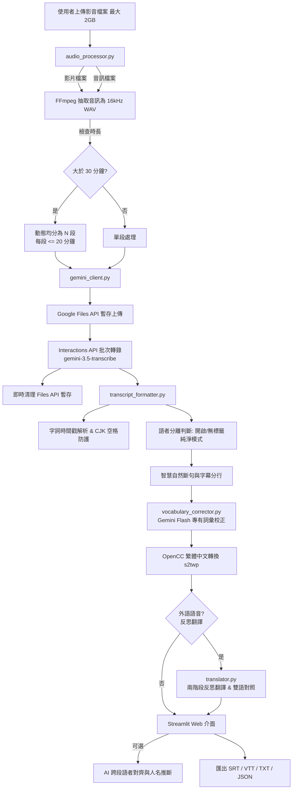

# Gemini 3.5 Transcribe 影音語音辨識與語者分離系統 🎙️

[](https://www.python.org/downloads/)
[](https://streamlit.io/)
[](https://ai.google.dev/)
[](https://ai.google.dev/)
[](LICENSE)

基於 Google **Gemini 3.5 Transcribe** 模型的端到端影音辨識與多格式字幕產生系統。支援長影音自動剝離音訊、動態均分切段、語者分離（Speaker Diarization）、專有詞彙同音字校正、台灣繁體中文自動轉換、**Reflective Translation 兩階段反思翻譯與雙語字幕**，以及一鍵匯出 **SRT / VTT / TXT / JSON** 四種格式字幕。

---

## 📑 目錄
- [🌟 核心特色](#-核心特色)
- [🧩 系統架構流程](#-系統架構流程)
- [🛠️ 核心避坑防護設計](#️-核心避坑防護設計)
- [🚀 快速開始](#-快速開始)
  - [1. 環境準備](#1-環境準備)
  - [2. 安裝依賴](#2-安裝依賴)
  - [3. 設定 API Key](#3-設定-api-key)
  - [4. 啟動 Web 介面](#4-啟動-web-介面)
- [🖥️ 介面功能詳解](#️-介面功能詳解)
- [🧪 執行單元測試](#-執行單元測試)
- [📂 專案架構](#-專案架構)
- [❓ 常見問題與排錯 (FAQ)](#-常見問題與排錯-faq)
- [🙏 參考與致謝](#-參考與致謝)

---

## 🌟 核心特色

1. **影音雙棲支援 & 2GB 大檔上傳**：
   - 支援 MP4, MOV, MKV, AVI, WEBM, WAV, MP3, M4A, FLAC, OGG。
   - 內建設定解除 Streamlit 預設 200MB 上傳限制，**最高支援 2GB（2048 MB）超長高畫質影片直接上傳**，由後端自動提取為 16kHz 單聲道 16-bit PCM WAV。
2. **長音訊無零頭動態均分**：
   - 音訊超過 30 分鐘時，採動態平均切分：`count = ceil(總時長 / 1200秒)`。
   - 每段時長均等且皆小於 20 分鐘，既避開 API 30 分鐘上限，又杜絕產生數秒鐘的極短零頭段落。
3. **高精度語者分離 & 純淨無標籤雙模式**：
   - **開啟時**：透過 Interactions API 識別不同發言者（`語者 1`, `語者 2`...），跨段落自動加上命名空間（如 `[第1段-語者1]`、`[第2段-語者1]`）。
   - **關閉時**：全面壓制語者前綴，匯出之 SRT / VTT / TXT 與預覽畫面皆為乾淨純淨字幕，**絕不殘留 `[語者 1]` 假定標籤**。
4. **專有詞彙 LLM 兩階段校正**：
   - 突破官方 API 限制（原生 `custom_vocabulary` 與語者分離互斥）。
   - 轉錄後交由 Gemini Flash 進行專有名詞、同音字精準校準，完全不影響時間戳與語者標記。
5. **網頁即時切換五款 LLM 模型**：
   - 側邊欄隨選校正、翻譯與推斷模型，預設 **Gemini 3.5 Flash Lite**，並提供 **Gemini 3.5 Flash**、**Gemini 3.6 Flash**、**Gemini 3.7 Flash**、**Gemini 3.8 Flash**，無需更改任何程式碼。
6. **台灣繁體中文 (OpenCC s2twp) 自動轉換**：
   - 解決 Google 語音模型原生偏向輸出簡體字的問題。
   - 預設自動進行台灣用語與標準正體轉換（如「軟件」->「軟體」、「項目」->「專案」）。
7. **反思式字幕翻譯 (Reflective Translation) & 雙語字幕**：
   - 嚴格遵循 `/reflective-translation` 兩階段自審工作流（初譯 -> 口語化/長度/術語自審 -> 終稿潤飾）。
   - 外語語音（英文、日文等）可自動或一鍵執行反思式翻譯為台灣正體中文，嚴格保護專有名詞（如 PyTorch, Docker, Anthropic）原文大小寫。
   - **多模態檢視**：支援「正體中文譯文」、「雙語對照字幕 (繁中+原文)」、「原始轉錄」即時切換預覽與下載。
   - **反思筆記透明化**：提供折疊面板展示「💡 AI 反思翻譯筆記 (Reflection Notes)」，清楚交代術語抉擇與口語修訂理由。
   - **高強韌容錯引擎**：採 40 句分批處理、Pydantic 結構化約束（Constrained Decoding）及 Regex 容錯萃取器，杜絕雙引號未跳脫導致的 JSON 解析崩潰。
8. **AI 跨段語者統一與真名推斷**：
   - 由 Gemini 分析對話中的自我介紹（如「我是 Sarah」）或稱謂證據（如「Evan 你進度如何」）自動對齊跨段代號並標記真實姓名（如 `[Evan (語者 1)]`）；無確鑿證據則忠實保留代號，嚴防幻覺。
9. **四大格式一鍵匯出**：
   - **SRT**：標準影音播放器字幕（支援純譯文、雙語對照或純淨無標籤）。
   - **VTT**：網頁 HTML5 `<video>` 播放字幕。
   - **TXT**：發言者標註或純時間戳之會議逐字稿。
   - **JSON**：含字詞層級時間戳（`word_info`）之完整結構化數據。
10. **隱私與安全**：
    - 轉錄完成後立即於 `finally` 區塊刪除 Google Files API 雲端副本與本機暫存檔案。

---

## 🧩 系統架構流程



---

## 🛠️ 核心避坑防護設計

| 潛在問題 / API 陷阱 | 官方 / 框架原生行為 | 本專案解決方案 |
| :--- | :--- | :--- |
| **Streamlit 200MB 上傳門禁** | `st.file_uploader` 預設限制 200MB，超過直接在網頁端拒收報錯 | 內建 [`.streamlit/config.toml`](.streamlit/config.toml)，將上限調升至 2048MB（2GB） |
| **語者分離無標註** | 缺少 `timestamp_granularities: ["word"]` 時，API 回傳 200 但完全不帶語者代號 | 強制在請求體中帶入 `timestamp_granularities: ["word"]` |
| **關閉語者分離仍帶標籤** | 若無語者資訊，多數系統會 fallback 強制指派「語者 1」 | 實作純淨模式判斷，關閉語者分離時嚴格過濾所有 `[語者 1]` 標籤 |
| **專有詞彙與語者互斥** | 在 Interactions API 同時傳入 `custom_vocabulary` 與語者分離會直接報錯 HTTP 400 | 改由兩階段管線處理：取得轉錄結果後，交由 Gemini Flash 進行二次同音詞對齊校正 |
| **長字幕翻譯 JSON 報錯** | 翻譯上百句字幕時，LLM 輸出引號未跳脫拋出 `Expecting ',' delimiter` | 採 40 句分批處理 + Pydantic Schema 約束 + Regex 容錯萃取器 |
| **macOS MIME 型態錯誤** | macOS 內建推斷 WAV 為 `audio/x-wav`，與 API payload 的 `audio/wav` 不符報錯 400 | 上傳時顯式聲明 `audio/wav`，並動態抓取雲端資源 MIME 嚴格對齊傳入 |
| **切段零頭散段** | 60 分 5 秒若切 30m+30m+5s，尾段浪費配額且辨識差 | 採均分演算法 `ceil(3605/1200) = 4` 段，每段 15 分鐘均勻分配 |
| **跨段語者代號衝突** | 第 2 段的 `spk:0` 與第 1 段的 `spk:0` 無關，直連會造成誤讀 | 加入段落命名空間 `第1段-語者1`，並提供 AI 依語境推斷對齊 |
| **中文單字空格陷阱** | 字詞標註連綴時英文需空格，中文會變成「你 好 世 界」 | 實作 CJK 字元判定與標點符號自動貼合演算法 |
| **預設輸出簡體中文** | Google 語音模型訓練基底多為簡體中文 | 內建 OpenCC 台灣習慣用語轉換器（`s2twp`），預設自動轉繁體 |

---

## 🚀 快速開始

### 1. 環境準備
- 系統支援：macOS, Linux, Windows
- Python 版本：`Python 3.12+`

### 2. 安裝依賴

本專案自帶 `imageio-ffmpeg` 二進位執行檔，**無需另外手動安裝系統級 FFmpeg**！

**推薦使用 `uv` 進行快速安裝：**
```bash
# 安裝 uv (若尚未安裝)
curl -LsSf https://astral.sh/uv/install.sh | sh

# 複製儲存庫
git clone https://github.com/japen0617/gemini_Transcribe.git
cd gemini_Transcribe

# 建立虛擬環境並安裝依賴
uv sync
```

*或使用一般 pip：*
```bash
python3 -m venv .venv
source .venv/bin/activate
pip install -r <(python3 -c "import toml; [print(d) for d in toml.load('pyproject.toml')['project']['dependencies']]")
```

### 3. 設定 API Key
請前往 [Google AI Studio](https://aistudio.google.com/) 取得免費的 Gemini API Key。

複製範本檔案建立 `.env`：
```bash
cp .env.example .env
```
在 `.env` 中填入金鑰：
```env
GEMINI_API_KEY=your_gemini_api_key_here
```
*(亦可直接在 Web 側邊欄輸入，兩者皆支援)*

### 4. 啟動 Web 介面
```bash
uv run streamlit run app.py
# 或使用虛擬環境：
# source .venv/bin/activate && streamlit run app.py
```
啟動後於瀏覽器打開 `http://localhost:8501` 即可開始體驗！

---

## 🖥️ 介面功能詳解

1. **左側邊欄**：
   - **Gemini Developer API Key**：輸入或讀取環境變數。
   - **開啟語者分離**：勾選以識別不同發言者；**取消勾選則輸出純淨字幕（完全無語者標籤）**。
   - **語言偏好**：預設 `繁體中文 (zh-TW)`，支援自動偵測、英文、日文等。
   - **字幕輸出字體**：預設 `繁體中文 (台灣習慣用語 s2twp)`，提供標準繁體、簡體或原始輸出。
   - **反思式翻譯開關**：預設勾選，當偵測為外語時自動啟動兩階段反思翻譯為台灣繁體正體。
   - **專有詞彙與翻譯模型**：可自由挑選 `Gemini 3.5 Flash Lite` (預設)、`3.5 Flash`、`3.6 Flash`、`3.7 Flash`、`3.8 Flash`。
   - **斷句參數微調**：停頓間隔秒數門檻（預設 1.2 秒）與單行最大字數（預設 30 字）。
2. **主操作區**：
   - **專有詞彙與術語清單**：同時支援【轉錄校正】與【反思翻譯】：
     - **保留原文**：直接輸入英文詞彙（如 `switch, AP, Extreme Switching`），翻譯時強制鎖定保留英文，絕不誤翻為中文。
     - **指定譯法**：輸入對照格式（如 `network -> 網路`, `stacking -> 堆疊`），翻譯時嚴格採用此譯名。
   - **會議筆記**：可輸入參與者名單備忘，提供 AI 更充份的推斷線索。
   - **轉錄與翻譯進度條**：多階段進度狀態顯示（含流式翻譯進度回報）。
   - **字幕顯示模式切換**：可一鍵切換「正體中文譯文」、「雙語對照字幕 (繁體中文 + 原文)」或「原始轉錄文字」。
   - **AI 反思筆記展示**：折疊面板呈現術語保留考量與口語調整細節。
   - **AI 跨段對齊**：語者分離開啟時，可點擊「🤖 執行跨段對齊與人名推斷」查看稱謂證據報告。
   - **字幕即時預覽與四大下載按鈕**：直接下載 `.srt`, `.vtt`, `.txt`, `.json`。

---

## 🧪 執行單元測試

本專案附帶 14 項完整的自動化單元測試，涵蓋動態切段、音訊提取、CJK 空格過濾、時間戳計算、字幕格式化、反思翻譯、專有詞彙對照保護與無語者標籤模式驗證：
```bash
uv run pytest -v
```

測試涵蓋重點：
- `test_calculate_chunk_plan_short`：驗證短音訊不切段。
- `test_calculate_chunk_plan_long`：驗證 35 分鐘均分 2 段、60 分 5 秒均分 4 段且皆 <= 20 分鐘。
- `test_extract_audio_and_duration`：驗證音訊抽取與採樣率 16000Hz 轉換。
- `test_cjk_detection_and_space`：驗證中文不空格、英文正確空格。
- `test_timestamp_formatting`：驗證 SRT/VTT 毫秒與逗號/點號格式。
- `test_convert_subtitles_script`：驗證 OpenCC 台灣常用語繁體字轉換。
- `test_diarization_disabled`：驗證關閉語者分離時完全無 `[語者 1]` 標籤。
- `test_reflective_translate_mocked`：驗證反思翻譯與雙語字幕結構合併。
- `test_safe_parse_with_unescaped_quotes`：驗證譯文包含未跳脫引號時的 Regex 容錯恢復。
- `test_batching_translation`：驗證超過 40 句字幕時之自動分批翻譯機制。

---

## 📂 專案架構

```
gemini_Transcribe/
├── .streamlit/
│   └── config.toml             # Streamlit 配置：放寬上傳上限至 2GB
├── app.py                      # Streamlit 前端網頁應用
├── audio_processor.py          # 影片音訊剝離、時長偵測與動態均分切段模組
├── gemini_client.py            # Gemini Interactions API 與 Files API 客戶端
├── transcript_formatter.py     # 字詞時間戳解析、CJK 空格處理、OpenCC 轉換與字幕匯出
├── vocabulary_corrector.py     # 專有詞彙同音字校正與 AI 跨段語者真名推斷
├── translator.py               # /reflective-translation 反思式翻譯、雙語字幕與分批容錯模組
├── pyproject.toml              # 專案依賴與 pytest 配置
├── .env.example                # 環境變數設定範本
├── .gitignore                  # Git 忽略設定
└── tests/
    ├── test_audio_processor.py       # 切段演算法與音訊處理單元測試
    ├── test_transcript_formatter.py  # CJK 空格、斷句、字體轉換、純淨模式與字幕測試
    └── test_translator.py            # 反思式翻譯、雙語字幕、引號容錯與分批測試
```

---

## ❓ 常見問題與排錯 (FAQ)

#### Q1：為什麼上傳長影片時轉錄時間較久？
> 因為系統採取高品質的批次轉錄端點（Interactions API）並要求字詞級的時間戳與語者標記，每 20 分鐘音訊通常需要約 30~60 秒的雲端模型運算時間，請稍候進度條推進。

#### Q2：如果音訊剛好超過 30 分鐘（例如 31 分鐘），會怎麼切？
> 系統會以 20 分鐘為基準單位進行均分：`ceil(31 / 20) = 2` 段，自動均分為兩段各 15.5 分鐘，完全避開 30 分鐘上限，且絕不會切出「30 分鐘 + 1 分鐘」這種零頭散段。

#### Q3：雲端暫存檔案是否安全？
> 非常安全。音訊上傳至 Google Files API 完成轉錄後，程式會在 `finally` 區塊立即發出 DELETE 請求銷毀雲端暫存檔；本機切段檔案亦會在轉錄完成後自動刪除。

#### Q4：為什麼以前上傳超過 200MB 的影片會被擋住？
> 這是 Streamlit 網頁框架原生的預設限制（`maxUploadSize = 200`）。專案已內建 `.streamlit/config.toml` 將限制提高至 **2GB（2048 MB）**，大容量長影片已可直接拖曳上傳由後端自動剝離音訊。

#### Q5：我不需要 `[語者 1]` 標籤，如何產出乾淨字幕？
> 只要在左側邊欄將「開啟語者分離」取消勾選，系統會進入無標籤純淨模式，所有預覽與匯出之 SRT / VTT / TXT 檔案都不會出現任何語者代號。

---

## 🙏 參考與致謝

- [Evan Lin: [AI 實戰] Gemini 3.5 Transcribe 的兩顆模型：即時逐字稿與語者分離](https://www.evanlin.com/gemini-3.5-transcribe-live/)
- [Google AI Studio 官方文件](https://ai.google.dev/)
- [Streamlit 開發社群](https://streamlit.io/)
- [OpenCC 開源中文轉換專案](https://github.com/BYVoid/OpenCC)

---

## 📄 授權條款
本專案採用 [MIT License](LICENSE) 開源授權。
